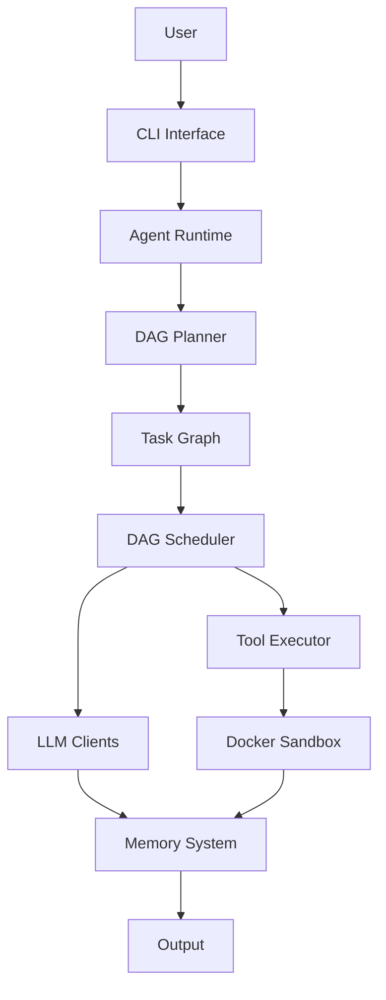
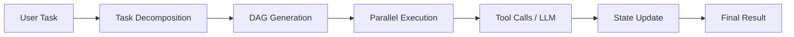

# 🚀 SourceBot

> ⚡ A Devin-style autonomous coding agent framework  
> Plan → Execute → Iterate with DAG-based workflows

---
## ⚡ TL;DR

SourceBot is an autonomous agent runtime that:

- Plans tasks as a DAG
- Executes them with tools + LLMs
- Maintains memory and state
- Supports retry, resume, and parallel execution

---

## 🔥 Why SourceBot?

Most AI tools today are **chat-based**.

SourceBot is different.

It is built to **plan, execute, and iterate** — like a real developer.

* 🧠 Plans tasks using a DAG (not linear prompts)
* 🔧 Uses tools (shell, skills, APIs)
* 🔁 Retries, resumes, and replays execution
* 💾 Maintains memory across steps
* 🐳 Runs safely in sandboxed environments

> This is not a chatbot.
> This is an **agent runtime**.

---

## 🎬 Demo

```bash
sourcebot init
sourcebot init_workspace
sourcebot cli
```
> ⚡ Example: Build a Python HTTP server autonomously


> ⚡ Demo is shortened for clarity

---

## 🧠 What Makes It Different

### 🔀 DAG-Based Execution (Core Innovation)

Unlike traditional agents:

```text
Prompt → LLM → Response
```

SourceBot:

```text
Task
 ↓
Decomposition
 ↓
DAG Graph
 ↓
Parallel Execution
 ↓
Tool + LLM Calls
 ↓
State + Memory Update
```

✅ Parallelizable
✅ Retryable
✅ Resumable
✅ Observable

---

## 🧩 Core Features

### 🧠 Agent Runtime

* Modular architecture
* Identity + context system
* Multi-provider LLM abstraction

---

### 🔀 DAG Execution Engine

* Task decomposition
* Parallel scheduling
* Retry policies
* Run state persistence
* Partial replay

---

### 🛠 Tool System

* Tool registry
* Shell execution
* Skill-based extensions

---

### 💾 Memory System

* Sliding window memory
* LLM-based summarization
* Persistent storage

---

### 💬 CLI Interface

* Interactive agent shell
* Safe runner
* Workspace bootstrap

---

### 🐳 Sandbox Execution

* Docker isolation
* Safe tool execution

---

## 🏗 Architecture

### 🔷 High-Level Architecture



---

### 🔷 Execution Flow



---

## 📁 Project Structure

```text
sourcebot/
├── bus/              # Event system
├── cli/              # CLI interface
├── config/           # Config system
├── context/          # Context + skills
├── conversation/     # Conversation layer
├── docker_sandbox/   # Execution isolation
├── llm/              # LLM abstraction
├── memory/           # Memory system
├── runtime/          # Agent + DAG engine
├── tools/            # Tooling system
├── session/          # Persistence
└── utils/            # Utilities
```

---

## 🚀 Installation

```bash
git clone https://github.com/DavidVi2Bot/sourcebot.git
cd sourcebot
pip install -e .
```

---

## 🧪 Development

```bash
pip install -r requirements-dev.txt
pytest
black .
ruff check .
```

---

## 🛣 Roadmap

### 🧱 Core

* [x] DAG execution engine
* [x] Tool system
* [x] CLI runtime
* [x] Memory system

### 🚧 Next

* [ ] Web UI (IDE-like)
* [ ] Multi-agent collaboration
* [ ] Plugin / marketplace system
* [ ] Long-term memory (vector DB)
* [ ] Remote execution / cloud runtime

---

## 🧠 Vision

SourceBot aims to become a **general-purpose autonomous agent framework**:

* 🧑‍💻 Coding agents (Devin-style)
* ⚙️ DevOps automation
* 🔬 Research agents
* 🔄 Workflow orchestration

---

## ⚠️ Status

> 🚧 Alpha — rapidly evolving

Expect breaking changes and fast iteration.

---

## 🤝 Contributing

We welcome contributions!

* Bug reports
* Feature ideas
* Tools / skills
* Documentation improvements

---

## ⭐ Star History

If this project interests you, give it a ⭐ — it helps a lot!

---

## 📄 License

MIT License

---

